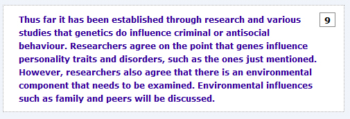
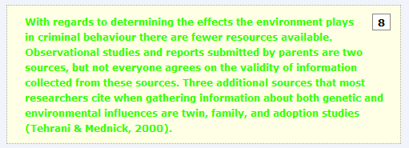
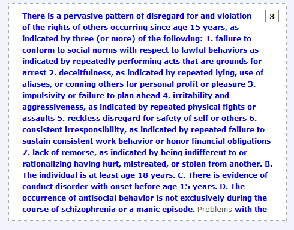
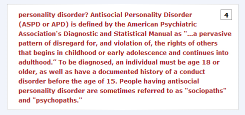
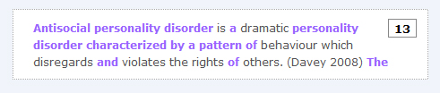
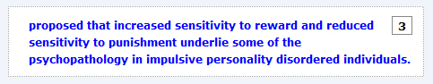
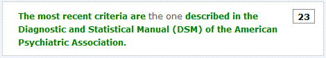
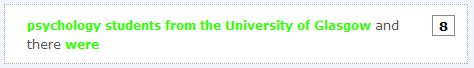

```{r setup, include=FALSE}
knitr::opts_chunk$set(echo = TRUE)
library(webexercises)
library(tidyverse)
```

<style>
h1:not(.title), #TOC > ul.tocify-header > li:first-child {
  font-weight: bold; 
  color: green; 
}

h2, #TOC ul.tocify-subheader[data-tag="2"] > li.tocify-item {
  color: blue; 
}

h3, #TOC ul.tocify-subheader[data-tag="3"] > li.tocify-item {
  color: purple;
  font-variant: small-caps; 
}

body{
  font-family: Arial;
}

</style>

# This blog

This document was last updated on `r Sys.Date()` and is an introduction to similarity checking through TurnItIn developed by Dr Helena Paterson, Dr Niamh Friel, Dr Kirsty Ainsworth, and Dr Phil McAleer. It shows areas that will need addressing if flagged by TurnItIn, areas that may get flagged but are not of concern, and four test questions to check your understanding.

**Please note:** if viewing this blog on a phone, use landscape orientation rather than portrait for better functionality.

# Areas to address

Below are a number of examples that you might see in your TurnItIn report and should try to amend by editing where possible. Note that the colors will be different on the actual TurnItIn report and this is purely to show the general idea.

### A block of text


This is very poor practice and basically means that you have lifted a piece of text directly from a source without referencing the original author.

**Avoid this by using your own words and citing the source of the information**

Steps to try:

* Read your highlighted paragraph and the surrounding text within your coursework. Think about what you are trying to show and try to express these ideas in your own words. This does not mean changing a few words here and there!

* Consider the concepts and ideas and how they relate to your discussion of the coursework topic. Always remember to reference where you sourced the original material, using the names of the authors and the date in the text.

### A block of text with reference


This image shows a whole paragraph being copied and a reference added to show where the paragraph came from. This is not allowed as even when you have a reference you must always ensure you have written in your own words.

**Avoid this by using your own words and citing the source of the information**

Steps to try:

* Read your highlighted paragraph and the surrounding text within your coursework. Think about what you are trying to show and try to express these ideas in your own words. This does not mean changing a few words here and there!

* Consider the concepts and ideas and how they relate to your discussion of the coursework topic. Always remember to reference where you sourced the original material, using the names of the authors and the date in the text.

### A list


You may see this if you take a whole list from a source. It's very easy to copy a list, especially if you are trying to describe the characteristics of a disorder. But remember, if you copy it word for word then it is plagiarism.

**Avoid this by using your own words and citing the source of the information**

Steps to try:

* It can be difficult to write a list in your own words so, you should consider why you are using a list. 

* Sometimes you may not need to use a list at all. You may be able to express these ideas in your own way using a different format.
* Look at the context of the list within your essay and think about what idea or concept you are trying to convey. 
* Always remember to appropriately reference the source.

### A block of text with quotes


If you are adding quotes to your coursework then you must be able to show where they came from by appropriately referencing the source.

**Avoid this by using your own words and citing the source of the information**

Steps to try:

* As you have sections of highlighted text around your quotes you should at least express these ideas in a different way. 
* You may decide to integrate these sections into your quotations, however it is best to write in your own words. 
* Consider rewriting the whole section and think about why you are using direct quotations. Quotations often seem like a good idea but can actually reduce the clarity and readability of the overall piece * So, think about how the quotations fit into your coursework. You may not need them at all!

### Bad Paraphrasing


If you have bits and pieces of highlighted text among normal text, as shown here, this can indicate that you have poorly paraphrased a source. This means you have not fully expressed this idea in your own words. You have also essentially copied the structure of someone else's work.

**Avoid this by using your own words and citing the source of the information**

Steps to try:

* Read your highlighted sentence and the surrounding sentences within your coursework. Think about what you are trying to show and try to express these ideas in your own words. All you have done so far is change a few words here and there!

### A sentence


If you have a small highlighted area it can indicate that you have copied a sentence from a source. You must go through your notes and find were you lifted this sentence from and change your sentence.

Steps to try:

* Read your highlighted sentence and the surrounding sentences within your coursework. Think about what you are trying to show and try to express these ideas in your own words.

# Highlighted but not Plagiarism

It is important to be aware that not everything highlighted by TurnItIn is plagiarism. This section provides information about parts of your work that may be highlighted, but that may not be plagiarised.  You should still look at all of these areas of similarity and make a judgement call about whether you cold have written them in  different way.

### Common words

Sometimes Turnitin picks up things such as "and", "this" or "the". 

* If this happens to you please do not worry. This is normal and will happen to most people. 

### Technical Statistical Terms

When running your lab reports through the system you will often find parts
of your results highlighted. For example; comparisons, t-tests, means and ANOVA.

* If this happens to you please do not worry. Everyone on the module will have similarities such as this.

### Common Methodological Words

When describing how you conducted or will conduct your study, sometimes TurnItIn will identify that similar phrases have been 
used by other sources. For example, "University of Glasgow" or "participation was voluntary"

* If this happens to you please do not worry. However, do review these segments and consider whether it could have been phrased in a different way or is this just how it is stated. It helps to have a good understanding about what you are writing when making this decision.

### Common Psychology Terms

Sometimes Turnitin picks up groups of words that often appear together in psychology essays. For example, "theory of mind" or "cognitive dysfunction". In psychology there are many words you have to use and cannot change.

* If this happens, then please do not worry. This is not plagiarism, but do cite the source if you have made a summary or definition. 

### Quotes

Sometimes TurnItIn identifies quotations in similarity reports. If you have a direct quote, and you have the name of the author, date of publication and a page number, this is not a problem. 

* As long as you have put the quote in quotation marks and cited the author, date and page number this is not plagiarism. 

### Citations

TurnItIn may highlight a citation as similar to other sources. This is normal and will happen for some individual citations.

* If this happens, please do not worry. What you should not do however is to copy another person's entire references section, this is plagiarism.

# Test Yourself

There is now a series of questions based on the above for you to have a quick run through to check your understanding. The solutions are there with each question for you to confirm your thinking with.


### Question 1

* True or False, the below text is not an example of plagiarism. `r torf(FALSE)`


`r hide("Explanation")`

The correct answer is 'False'.

This is plagiarised because the student has simply lifted the block of text from the source. They have not put it into their own words and they have not cited the source. This is very poor and should never happen!

`r unhide()`

### Question 2

* True or False, the below text is not an example of plagiarism. `r torf(TRUE)`



`r hide("Explanation")`

The correct answer is 'TRUE'.

This is not plagiarised because the student has correctly written out the name of a psychological scale. This cannot be put into their own words. Do not worry about things like this.

`r unhide()`

### Question 3

* True or False, the below text is an example of plagiarism. `r torf(FALSE)`



`r hide("Explanation")`

The correct answer is 'FALSE'.

This is not plagiarised because the student has correctly written out the sample of people they used. This will happen very often in the method section of the report. So, do not worry about this.

`r unhide()`

### Question 4

* True or False, the below text is an example of plagiarism. `r torf(TRUE)`


`r hide("Explanation")`

The correct answer is 'TRUE'.

This is plagiarised because the student has copied someone elses work but has changed a few words. They have not expressed the concept in their own words. This is not acceptable.

`r unhide()`